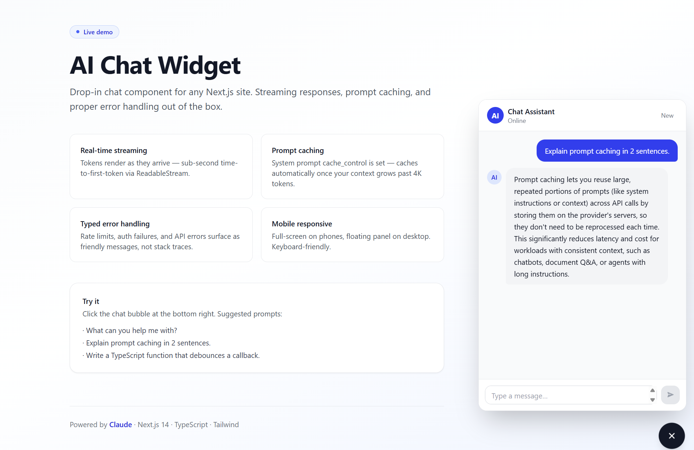

# AI Chat Widget

Production-grade chat widget for any Next.js site. Drop-in component, streaming responses, prompt caching, and proper error handling.

**Powered by:** Claude (Anthropic) · Next.js 14 App Router · TypeScript · Tailwind CSS

[**Live Demo →**](https://ai-chat-widget-inky.vercel.app)



---

## Why this exists

Most "chat widget" boilerplates skip the hard parts — streaming, typed error handling, mobile responsive UX, and abort support. This repo ships the full thing in a small, readable codebase.

## Features

- **Real-time streaming** — Tokens render as they arrive via `ReadableStream`. Sub-second time-to-first-token.
- **Prompt caching ready** — `cache_control: ephemeral` set on the system prompt; caches automatically once context grows past Opus 4.7's 4096-token minimum.
- **Typed error handling** — `Anthropic.RateLimitError`, `AuthenticationError`, and `APIError` instances are caught with `instanceof` checks (never string-matching) and surfaced as friendly UI messages.
- **Mobile responsive** — Full-screen on phones, floating panel on desktop.
- **Markdown rendering** — Code blocks, lists, links rendered via `react-markdown` with `remark-gfm`.
- **Abort support** — Users can stop a streaming response mid-generation.
- **Conversation history capping** — Last 20 turns sent to API to control token cost.
- **Input sanitization** — 8K-char limit per message, role validation, JSON parse guard.

---

## Quick start

```bash
npm install
cp .env.example .env.local
# Edit .env.local — paste your ANTHROPIC_API_KEY
npm run dev
```

Open [http://localhost:3000](http://localhost:3000) and click the chat bubble.

Get an API key at [console.anthropic.com/settings/keys](https://console.anthropic.com/settings/keys).

---

## Deploy to Vercel

The live demo is deployed with two commands:

```bash
npm install -g vercel
vercel --prod
```

When prompted, add `ANTHROPIC_API_KEY` as an environment variable (set it as **sensitive**).

---

## Project structure

```
ai-chat-widget/
├── app/
│   ├── api/chat/route.ts      # Streaming endpoint (Anthropic SDK → ReadableStream)
│   ├── globals.css            # Tailwind + markdown styles
│   ├── layout.tsx
│   └── page.tsx               # Landing page with embedded widget
├── components/
│   ├── chat-widget.tsx        # Main widget (launcher + panel + stream reader)
│   ├── chat-input.tsx         # Auto-resizing textarea with send/stop
│   └── message-bubble.tsx     # User/assistant bubbles + typing indicator
├── lib/
│   ├── anthropic.ts           # SDK client singleton
│   ├── types.ts               # ChatMessage, UIMessage types
│   └── utils.ts               # cn() helper
├── docs/
│   └── screenshot.png         # README image
├── .env.example
└── package.json
```

---

## How streaming works

1. Client `POST /api/chat` with the full message history.
2. API route validates input, instantiates `Anthropic` client, calls `client.messages.stream({...})`.
3. Server iterates the SDK's async iterator, writing each `text_delta` to a `ReadableStream<Uint8Array>`.
4. Client reads the stream with `getReader()`, decoding chunks via `TextDecoder` and updating React state on each chunk.
5. On completion, the controller closes and the connection ends.

The clean separation between server-side token streaming and client-side incremental UI update keeps the code under 600 lines total.

## How error handling works

The API route catches typed Anthropic exceptions in a `try/catch` block and writes a markdown-formatted error message into the stream. Errors appear in the assistant bubble as italicized text:

```
_Rate limited. Please wait a moment and try again._
```

Network errors (no response) are caught client-side in `chat-widget.tsx` and shown the same way.

---

## Customization

### Change the system prompt

Edit `SYSTEM_PROMPT` in `app/api/chat/route.ts`. To make prompt caching effective, expand it past 4096 tokens (e.g., paste your product docs, FAQ, or knowledge base).

### Change the model

```ts
model: 'claude-opus-4-7',    // most capable (default)
// or:
model: 'claude-sonnet-4-6',  // 3x cheaper, faster
// or:
model: 'claude-haiku-4-5',   // 5x cheaper, fastest
```

### Change the brand color

Edit `tailwind.config.ts` → `theme.extend.colors.brand`. The widget uses `brand-600` for primary, `brand-700` for hover.

### Embed on another site

Copy the `components/` and `lib/` folders into your existing Next.js project. Add `<ChatWidget />` to any page. The API route at `/api/chat` works with any Next.js 14 App Router setup.

---

## Cost estimates

Per 1,000 messages (assuming ~500 input tokens / ~200 output tokens):

| Model | Cost / 1K msgs | Notes |
|---|---|---|
| Opus 4.7 | ~$3.50 | Most capable |
| Sonnet 4.6 | ~$2.10 | Best balance |
| Haiku 4.5 | ~$0.70 | Cheapest |

With prompt caching (system prompt > 4K tokens), cached reads cost ~0.1× the input rate.

---

## License

MIT — use for any purpose, commercial or personal.

---

## Built by

[@leninug](https://github.com/leninug) — full-stack developer focused on React, TypeScript, and AI integrations. Available for [freelance work on Fiverr](https://www.fiverr.com/lnin88).
